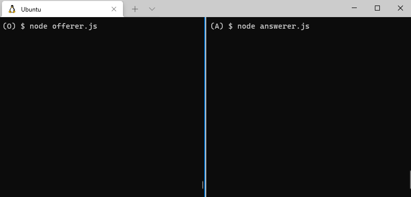
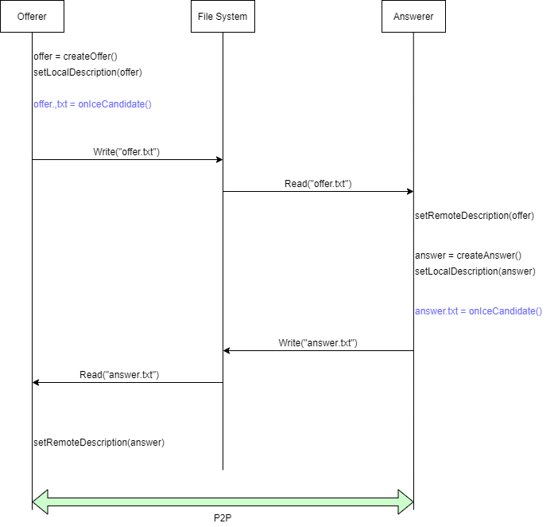

# Overview




# Install 

- Install nodejs and npm.
- Following is example in Ubuntu.

```bash
apt install -y nodejs
apt install -y nodejs
```

# Environment confirmed operation

- Ubuntu 20.04
- node v10.19.0 (npm 6.14.4)

# How to use

- Install `node_modules`.
- Following is example.

```bash
node install
```

- Open two Terminals in the single device.
- Excute `node offer.js` in Terminal 1.
- Excute `node answer.js` in Terminal 2.
- It recommend that `node offer.js` be excuted before excuting `node answer.js`.
- Otherwise you need to delete `*.txt` files in `./data/` folder before launch.

## Terminal 1

```bash
node offer.js
```


## Terminal 2
```bash
node answer.js
```

# Flow



